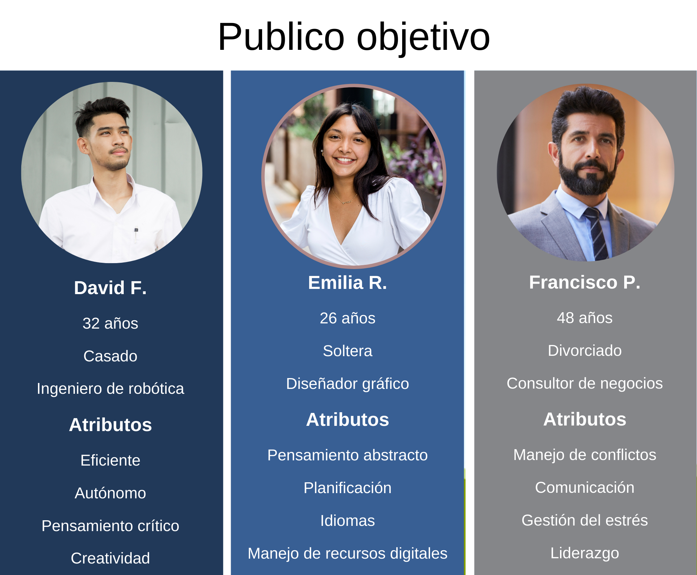

# Abogabot
## 1. Toma de requerimientos
El cliente (despacho de abogados) solicita una pagina web con soporte mobil y pc para automatizar la recepción y seguimiento de demandas de sus clientes.

### Cliente

- Crear cuenta cliente.
- Procesos mediante formularios.
- Proceso de pago.
- Seguimiento de sus demandas.

### Administrador

- Crear cuenta de abogado.
- Recibir notificaciones de nuevos casos.
- Recibir pagos.
- Actualizar el proceso de la demanda.

## 2. Buyer persona

## 3. Publico objetivo

## 4. UX

## 5. UI
